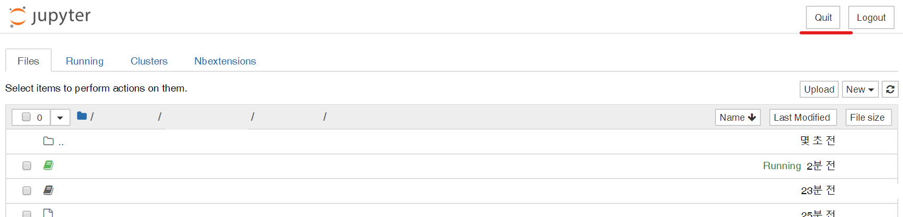

# Before Study
파이썬 스터디를 시작하기 전에 파이썬 개발 시 필요한 것들을 다운로드해야 합니다! 여기 아래에 있는 파일들을 설치해봅시다:)

## 1. Anaconda
Anaconda는 파이썬으로 개발된 모듈과 라이브러리를 모아둔 것입니다. 이것만 깔면 `numpy`, `pandas`, `jupyter notebook`, `SciPy`, `ScikitLearn` 등의 모듈을 각자 설치할 필요없이 바로 사용할 수 있습니다.

[여기](https://www.anaconda.com/distribution/)로 들어가서 자신이 쓰는 운영체제의 Anaconda를 까시면 됩니다!
**Python 3.7**과 **Python 2.7**이 있는데, 저희는 **Python 3.7**을 깔아주시면 됩니다.     

## 2. Jupyter Notebook
`Jupyter Notebook`은 웹 브라우저에서 파이썬 코드를 작성하고 실행해볼 수 있는 개발도구입니다. 자세한 내용은 [여기](http://pythonstudy.xyz/python/article/514-Jupyter-Notebook)를 참고해주세요!

### 2.1. 키는 법
* 검색에 `Jupyter Notebook`이라 치면, `Jupyter Notebook` 명령을 실행시킵니다.

* `conda prompt`에 `jupyter notebook` 명령어를 적고 엔터를 칩니다.

### 2.2. 끄는 법
* Jupyter Notebook의 `Quit` 버튼을 클릭합니다.

### 2.3. Markdown
마크다운 문법은 사용법이 매우 쉽고, 빠르게 문서를 정리할 수 있는 문법입니다. `Jupyter Notebook`에서는 이 마크다운 문법을 사용하여 문서를 작성할 수 있습니다.     

[여기](https://gist.github.com/ihoneymon/652be052a0727ad59601)에 마크다운 문법이 잘 정리되어 있으니 시간이 된다면 꼭 보시길 바랍니다:)

### 2.4. Jupyter Notebook Extensions
`Jupyter Notebook`을 사용하는데 유용한 extension을 담아놓은 페키지가 있습니다. 목차 생성, variable 검색 등을 할 수 있습니다.

1. **conda prompt**를 켜서 다음과 같은 명령어를 입력합니다.    
`conda install -c conda-forge jupyter_contrib_nbextensions`

2. `Jupyter Notebook`을 키면 `Nbextensions` 탭을 클릭합니다.

3. 원하는 extension을 `Enable`로 바꿔줍니다. (각 extension에 대한 설명은 해당 extension을 클릭하고 아래로 드래그하면 있습니다.)    

